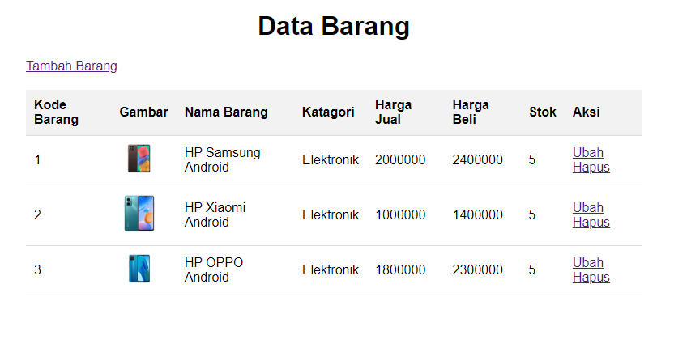
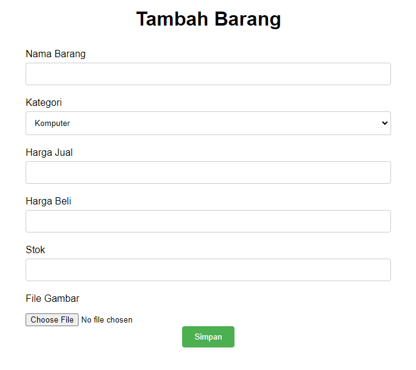
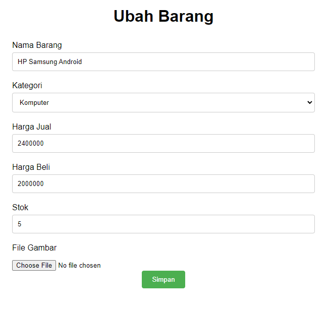
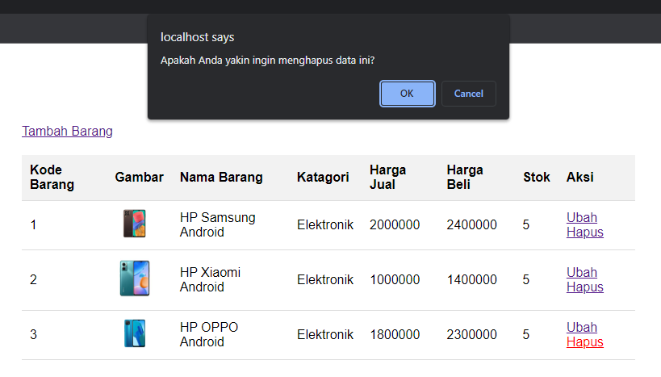

# Praktikum Pemograman Web 2

 #### Iman Setiawan
 #### 312110219
 #### Teknik Informatika

Membuat Program CRUD berbasis website dengan menggunakan Database MySQL

Berikut tampilan web index.\

Berikut tampilan Tambah Data\

Berikut tampilan Ubah Data\

Berikut tampilan saat mengapus data, akan mucul pop up notifikasi\

Terima Kasih
